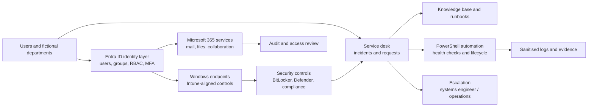

# Architecture Diagram

```mermaid
flowchart LR
    U["Users and fictional departments"] --> ID["Entra ID identity layer\nusers, groups, RBAC, MFA"]
    ID --> M365["Microsoft 365 services\nmail, files, collaboration"]
    ID --> EP["Windows endpoints\nIntune-aligned controls"]
    EP --> SEC["Security controls\nBitLocker, Defender, compliance"]
    U --> SD["Service desk\nincidents and requests"]
    SD --> KB["Knowledge base and runbooks"]
    SD --> AUTO["PowerShell automation\nhealth checks and lifecycle"]
    AUTO --> LOG["Sanitised logs and evidence"]
    SEC --> SD
    SD --> ESC["Escalation\nsystems engineer / operations"]
    M365 --> AUDIT["Audit and access review"]
```

The diagram is a target architecture. Each component will carry an implementation status as the project progresses.

